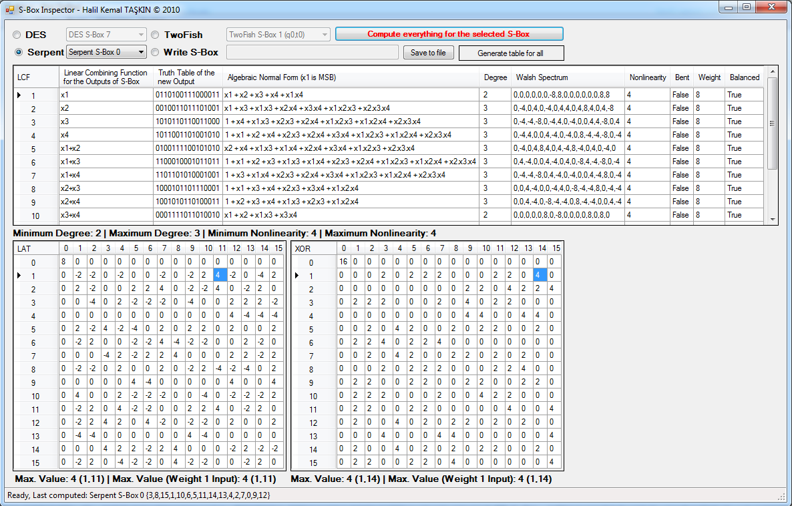

S-Box Inspector
===============
This solution has been developed as a term project while taking "Block Ciphers" graduate course at [IAM, METU](http://www.iam.metu.edu.tr) in 2010. It is developed with Visual Basic .NET using Visual Studio 2008 and .NET Framework 3.5. But, it is now upgraded to Visual Studio 2012 solution with .NET Framework 4.

The program mainly analyses 4x4 (4-bit input 4-bit output) S-Boxes used in the block cipher design. There are preloaded S-Box definitions in the program. Also, it is possible to write manually 4x4 S-Box.

The program computes three major parts: Boolen function analysis, Difference Distribution (DDT or XOR) Table and Linear Approximation Table (LAT) of given S-Box. In the boolean function analysis, all linear combinations of the S-Box output considered as a boolean function and details about these functions are computed.

A manual for the program can be downloaded from [here](Manual.pdf).

Here is a simple screenshot of the software:

